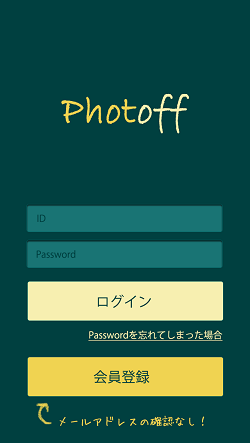
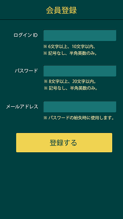
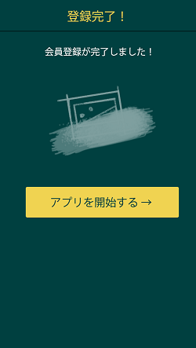
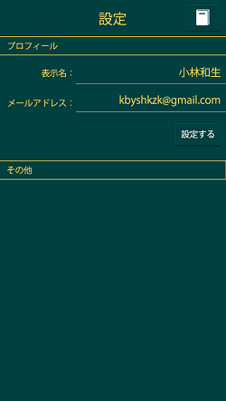
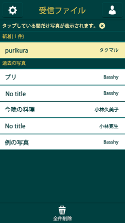
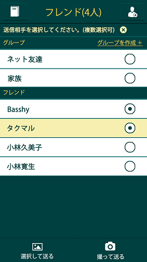
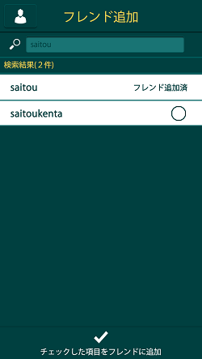

# 短期消滅型写真共有ツール Photoff
> 作成日：2013.12.　8　16:45  
> 更新日：2013.12.14　21:10

## はじめに
現存アプリの「Snapchat」の問題点を定義し、解消する。  
日本版「Snapchat」を作りたい。  
"写真を共有したい"となったときにすぐに共有できなければならない。  
(会員登録が面倒で共有を諦めてしまうことは絶対に防ぐ)

## コンセプト

日本人にとって、

- 学習しやすい
	- UIがわかりやすく、利用者にとって秩序のあるシンプルなデザイン構造であること。
- 効率的
	- 利用者のコンテキストを理解した設計をすることにより、目的達成のための効率を十分なのもにする。
- 心地よい
	- ストレスや不安を覚えない、安心できる体験を提供する。

## 問題点
### すべて
- その場で撮った写真しか共有できない。
	- スマートフォンに保存されている写真を共有することができない。
	- 日本にはプリクラ文化があるので、その場で撮った写真しか共有できないのでは不便である。
- 写真の見方がわかりづらい。(というかわからない)
	- 長押ししている間だけ見れるのは目新しいが、それゆえ気づかない。
- 送った相手と写真が間違っていないか不安になる可能性
	- 確認画面を設けることで対処(「○○さんへ、以下の写真を送信しますがよろしいですか？」等のメッセージと写真)

### Snapchatだけ
- UIが英語なので日本人は受け入れにくい。
- 表示している画面が何の画面なのかがわからない。
	- ヘッダーに画面タイトルをつけるだけでもすごくわかりやすいのに。
- コメント入力がiOSだと候補で隠れてしまう。
- 起動した時の画面
	- いきなりカメラなのは意図しない挙動である。
		- アプリがカメラマークではない。
	- 不安になる
		- シャッター音が鳴ってしまう可能性がある。
	- 起動時にはフレンドリストが出るようにする
		- スマホ内の写真を送信したい場合もあるので、起動時の画面がアカウントリストなのは好都合である。
- 写真リスト
	- まず「この画面で写真を見ることができる」というのがわからないという問題。
		- 画面が履歴という位置づけに見えるので、写真を見れる画面だと思いにくい。
	- 履歴っぽいので自分の送信履歴も見れるが、送った写真が確認できるわけでもないのでいらない。
	- リストを見ても、それが何の写真なのかがわからない。
		- 写真のサムネイルをしてしまっては意味ないが、写真にタイトルくらいはつけれるようにすべき。
- 登録が面倒
	- 登録をスムーズにするために入力項目を極限まで削る、他のSNSアカウントで登録できる、登録が不要などの処置。

### POKEだけ
- facebookアカウントを利用するので、facebookに登録している相手にしか送れない。
- 何の画面なのか説明がないため、何ができるのかが全くわからない。

## バックログ
- 電話帳を利用してフレンドリストに一斉登録
- 後に残したくないような写真を共有するので、リアルの人に見られたくない写真を共有する場合、アドレス帳が露出していると不安になる可能性アリ。(リアルの人と交換するコンテキストもあるので要検討。)
- ボイスメッセージの共有の検討
- スクリーンショット妨害機能
	- スクリーンショットを撮った場合の通知
	- スクリーンショットを撮った場合、ノイズ写真とすり替える。（できる？）
- 写真のトリミング機能
- シャッター音のON/OFF
- 起動時の画面をフレンドリストにするか、カメラにするか設定できるようにする。
- 後に残したくない写真を送るサービスの利用者をフレンドと呼ぶのは問題か議論
- 退会機能はなぜ必要なのか議論

## バックログからはずしたもの
### 採用
- 複数のフレンドをひとつのフォルダに入れる
	- フォルダを選択することで、一斉送信が簡単にできる。

### 不採用
- なし

## 機能要件

### ユーザ側
- 会員登録できる
	- ID
	- Password
	- 表示名
	- e-mail address
- 会員を検索し、フレンドリストに追加できる
	- 「ID」または「表示名」で検索できる。
- 写真を撮影し、送信できる
	- 撮影した写真を「ペイント」と「文字」で加工し、「制限時間」を設定し、送信できる。
	- 撮影した写真は、保存することもできる。
- 写真をスマホ内から選択し、送信できる
	- 選択した写真を「ペイント」と「文字」で加工し、「制限時間」を設定し、送信できる。
- 退会できる
	- IDとPasswordを入力することで、会員状態をOFFにできる。
	- 退会時に、任意でアンケートに答えてもらう。
- 受信した写真を表示することができる
	- 指定制限時間終了後、表示できなくなる。

### 管理側
- 会員数を確認できる

## ページ構成
### 画面基本
- スタート画面
- Passwordを忘れてしまった場合
- 会員登録
- フレンドリスト
- グループ作成
- 新規フレンド
- 受信写真リスト
- 送信写真リスト
- カメラ
	- 撮影画面
	- 加工画面
	- 確認画面
- 設定画面

### 画面詳細
- スタート画面
	- IDを入力
	- Passwordを入力
	- ログインボタン
	- 会員登録ボタン
	- Passwordを忘れてしまった場合
- Passwordを忘れてしまった場合
	- IDを入力
	- メールアドレスを入力
	- 送信ボタン
- 会員登録
	- ID
	- Password
	- 表示名
	- e-mail address
- フレンドリスト
	- フレンド追加ボタン
	- 設定ボタン
	- グループ作成
	- グループ一覧
		- 追加したばかりのグループは背景の色を変える
	- フレンド一覧
		- 追加したばかりのフレンドは背景の色を変える
	- チェックボックス
	- 写真を選択して送るボタン
	- 写真を撮って送るボタン
- グループ作成
- 新規フレンド
	- 検索フォーム
	- 結果一覧(未追加、既追加)
	- 追加(追加しますか？OK ,NO)
- 受信写真リスト
	- 受信写真タイトル
	- 受信時刻
	- 写真状態(新しい, 見た, 見れる)
	- 残り時間
- 送信写真リスト
	- 送信写真タイトル
	- 送信時刻
	- 送信相手がスクリーンショットを撮ったかどうか
	- 送信相手が画像を見たかどうか
- カメラ
	- 撮影画面
		- シャッターボタン
		- 撮影カメラの変更(内側、外側)
		- フラッシュ(Auto,ON,OFF)
		- 加工画面へ行くボタン
	- 加工画面
		- ペイント加工
		- 文字加工
		- 確認画面へ行くボタン
	- 確認画面
		- 写真タイトル記入
		- 撮影した写真
		- 制限時間設定
		- 送信ボタン
- 設定画面
	- 表示名変更
	- メールアドレス変更
	- ログアウト
	- プライバシーポリシー(へ遷移)
	- フレンド削除(へ遷移)

## 画面イメージ
### スタート画面

### 会員登録

### 登録完了

### 設定

### 受信ファイル

### フレンドリスト

### フレンド追加
